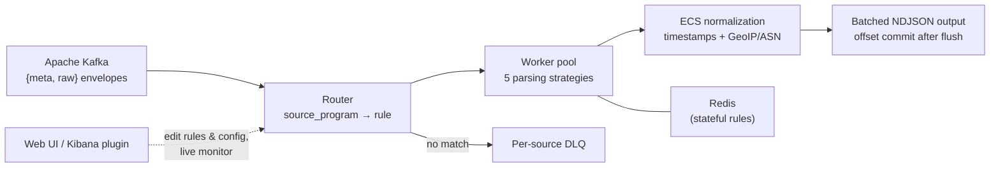

<p align="center">
  
</p>

<h1 align="center">TLSOC Engine</h1>

<p align="center">
  <b>High-performance, polymorphic log parsing and ECS normalization engine for Security Operations Centers.</b>
</p>

<p align="center">
  <a href="https://github.com/sankettaware16/tlsoc"></a>
  <a href="LICENSE"></a>
  <a href="https://github.com/sankettaware16/foss-soc-engine/actions/workflows/ci.yml"></a>
  
  
</p>

<p align="center">
  <a href="#getting-started">Getting Started</a> •
  <a href="docs/architecture.md">Architecture</a> •
  <a href="docs/writing-rules.md">Writing Rules</a> •
  <a href="docs/web-ui-guide.md">Web UI</a> •
  <a href="#tlsoc-ecosystem">Ecosystem</a>
</p>

---

## Overview

TLSOC Engine — this `foss-soc-engine` repository, historically *FOSS SOC Engine* —
is the parsing and normalization core of
the [TLSOC platform](https://github.com/sankettaware16/tlsoc). It consumes raw logs
from Apache Kafka, dynamically routes each line to the correct parser based on log
metadata, and normalizes it into structured,
[Elastic Common Schema (ECS)](https://www.elastic.co/guide/en/ecs/current/index.html)-compliant
JSON. It supports stateless regex parsing, stateful multi-line log reassembly, and
direct JSON/XML field mapping for high-throughput environments.

Parsers are YAML files, not code: supporting a new log source means writing (or
letting an AI write) a rule file, validating it with the built-in tools, and mapping
the source to it in configuration.

## Key Features

- **Polymorphic routing** — log sources are decoupled from parsing logic via
  configuration-based program mapping; one messy source can be routed through a
  *chain* of rules, first match wins.
- **Five parsing strategies** — `stateless` (single regex), `multi_match` (pattern
  list), `stateful` (Redis-backed multi-line transaction reassembly, e.g. Postfix),
  `json_map` (dot-path JSON mapping with wildcards), and `xml_xpath` (XML element
  mapping, e.g. OpenVAS/Nessus exports).
- **Fast at scale** — a `prematch` substring gate skips almost all regex evaluations
  (a 500-pattern rule measures ~13× faster), and a ReDoS lint rejects
  catastrophic-backtracking patterns before deployment.
- **Accurate event time** — `@timestamp` carries the event's *real* time parsed from
  the log line (CLF, ISO 8601/RFC 5424, RFC 3164, epoch, and more), normalized to
  UTC, with visible fallbacks (`event.timestamp_source`) — never silent.
- **Offline GeoIP + ASN enrichment** — one-time MaxMind database download, then
  every lookup is a local file read with per-process LRU caching. Both directions
  are enriched: `source.ip` (who is hitting you) *and* `destination.ip` (where
  your proxy traffic goes), ambiguous endpoint values are classified from
  `.address` into `.ip`/`.domain` per ECS, and fields MaxMind doesn't know are
  omitted — never emitted as nulls.
- **No silent data loss** — at-least-once Kafka delivery (offsets committed only
  after durable disk flush), per-source dead-letter queues with storm warnings,
  expired stateful transactions emitted and tagged instead of dropped.
- **Horizontal scaling** — a worker pool (one per CPU core by default) shares load
  through a single Kafka consumer group; scale across machines with the same
  `group_id`, no code or rule changes.
- **Operable** — live rule reload (~10 s), graceful shutdown, live health metrics
  (`logs/stats.json`), a browser console ([Web UI](docs/web-ui-guide.md)), and a
  native [Kibana plugin](elk-plugin/README.md).
- **Deploy with confidence** — `preflight.py` validates config, rules, ECS fields,
  Kafka, topics, Redis, and partitions in one command; `replicate.py` dry-runs the
  entire rsyslog → Kafka → engine pipeline locally; CI runs a golden-sample exam
  for every rule.

## Architecture



Full component and pipeline diagrams: [docs/architecture.md](docs/architecture.md).
The engine's place in the platform:
[tlsoc — Architecture](https://github.com/sankettaware16/tlsoc/blob/main/docs/architecture.md).

## Getting Started

### Prerequisites

- Python 3.8+ on Linux (Ubuntu/Debian recommended for systemd integration)
- Apache Kafka (input source) — for example via
  [TLSOCDockerDeploy](https://github.com/sankettaware16/TLSOCDockerDeploy)
- Redis (only if you use `stateful` rules)
- Optional: a free MaxMind license key for GeoIP/ASN enrichment

### Install

```bash
git clone https://github.com/sankettaware16/foss-soc-engine.git
sudo mv foss-soc-engine /etc/
cd /etc/foss-soc-engine
export MAXMIND_LICENSE_KEY=YOUR_KEY   # optional — enables GeoIP/ASN download
chmod +x install.sh
./install.sh
```

Then edit `config.yaml` (Kafka connection and `program_mapping`), and validate
everything before going live:

```bash
python3 preflight.py
```

Full installation guide — GeoIP databases, Redis, output directory, the
Elasticsearch index template, and the systemd service:
[docs/installation.md](docs/installation.md).
**Upgrading an existing deployment?** Follow the zero-data-loss migration in
[docs/upgrading.md](docs/upgrading.md) instead of installing over it.

### Run

```bash
sudo python3 main.py          # foreground (debug/development)
sudo ./setup_service.sh       # install + enable the systemd service
sudo systemctl status foss-soc
journalctl -u foss-soc -f
```

> The systemd service keeps its historical name `foss-soc` for compatibility with
> existing deployments.

## Usage

The parsing engine always runs from the command line (`main.py`, usually under
systemd). Three equivalent front-ends exist for writing/testing rules, editing
config, and watching the engine run — you are never locked into one:

| # | Interface | Best for | Needs a terminal? |
|---|---|---|---|
| 1 | **Command line** (`main.py` + `test_*` / `preflight` / `replicate` tools) | production servers, CI/CD, automation | yes |
| 2 | **[Web UI](docs/web-ui-guide.md)** — point-and-click browser console (secure login) | operators without a terminal; quick pilots | no |
| 3 | **[Kibana plugin](elk-plugin/README.md)** — the same console inside Kibana | teams already living in the ELK stack | no |

Common tasks:

```bash
python3 preflight.py                          # validate config + live infrastructure
python3 replicate.py --rsyslog <conf>         # dry-run the full pipeline, no Kafka
python3 test_rules.py                         # interactive rule tester
python3 test_file.py sample_logs.txt AUTO     # bulk-parse a file, auto-detect rules
python3 ecs_helper.py check rules/myrule.yaml # ECS field validation ("spell-check")
python3 benchmark.py                          # EPS + latency + live utilization % of YOUR setup
python3 benchmark.py --live                   # pipeline lag of the RUNNING deployment
python3 benchmark.py --history --index "..."  # lag/EPS timeline from ES: how did last week perform?
```

Tool reference and testing guide: [docs/development.md](docs/development.md).

### Writing parsing rules

Every field a rule produces must be a valid ECS field, and every rule gets a
golden-sample exam in CI. The step-by-step guide — including the **AI master
prompt** that turns raw log samples into a finished, ECS-compliant rule — is in
[docs/writing-rules.md](docs/writing-rules.md).

## Timestamps: which field means what

Every event carries several times. They answer different questions — dashboards,
latency triage, and audits each want a different one:

| Field | Meaning | Where it comes from |
|---|---|---|
| `@timestamp` | When the event **really happened**. This is what dashboards should sort and filter on. | Parsed from the log line itself (e.g. `[05/Aug/2026:09:38:46 +0000]` in an access log), normalized to UTC. |
| `event.ingested` | When the **engine parsed** it. | The engine's own clock. |
| `event.original_time` | The **raw timestamp string** exactly as it appeared in the log — for audit and debugging. | Copied verbatim, never normalized. |
| `event.created` | When the **shipper** (rsyslog) stamped the line, where a rule maps it. | The rsyslog prefix on the line. |
| `event.timestamp_source` | **How** `@timestamp` was obtained — every fallback is visible, never silent. | `log` = parsed, zone known · `log_assumed_utc` = parsed, zone assumed · `ingest_fallback` = unparseable, ingest time kept. |

**Pipeline lag** (source host → rsyslog → Kafka → engine) is computable per
event as `event.ingested − @timestamp`, and `benchmark.py --live` reports it
per module (avg/p50/p95/max) straight from your output files. Two readings
worth memorizing: steady seconds-level lag is healthy batching; **negative**
lag or lag that matches your UTC offset (e.g. ~5h30m) means a *source host's*
clock or timezone label is wrong — fix the source, not the engine.

## Repository Structure

```
├── main.py               # Application entry point (worker supervisor)
├── config.yaml           # Main runtime configuration
├── core/                 # Parsing engine (strategies, routing, output, ECS schema)
├── rules/                # YAML parsing rules, one per log source
├── utils/                # GeoIP enrichment, JSON acceleration
├── webui/                # Browser console (Flask)
├── elk-plugin/           # Native Kibana plugin + headless backend
├── elasticsearch/        # Generated ES index template + loader
├── examples/             # Runnable rsyslog + sample-log example
├── tests/samples/        # Golden-sample exams, one folder per rule
├── ecs_helper.py         # ECS field checker/fixer/search
├── benchmark.py          # Capacity (EPS/latency) + live pipeline-lag benchmark
├── preflight.py          # Pre-run validator (config + live infrastructure)
├── replicate.py          # Local dry-run of the rsyslog→Kafka→engine pipeline
├── test_*.py             # Regression battery (config, timestamps, enrichment, golden)
└── docs/                 # Documentation (see below)
```

## Documentation

| Document | Contents |
|---|---|
| [Installation](docs/installation.md) | Full install: GeoIP/ASN databases, Redis, output directory, ES index template, systemd |
| [Configuration](docs/configuration.md) | `config.yaml` reference: Kafka, program mapping, workers, batching, output, Web UI auth |
| [Architecture](docs/architecture.md) | Engine internals: routing, strategies, timestamps, enrichment, delivery guarantees |
| [Deployment & Scaling](docs/deployment.md) | Workers and partitions, multi-machine scaling, throughput, monitoring, envelope contract |
| [Writing Rules](docs/writing-rules.md) | Rule authoring guide, strategy selection, ECS cheat-sheet, AI master prompt |
| [Web UI Guide](docs/web-ui-guide.md) | The browser console: features, sign-in, network deployment |
| [Development & Testing](docs/development.md) | Test tools, golden samples, CI, contributing workflow |
| [Upgrading](docs/upgrading.md) | Zero-data-loss migration from an older deployment |
| [Kibana Plugin](elk-plugin/README.md) | Architecture and installation of the in-Kibana console |
| [Roadmap](docs/roadmap.md) | Planned engine work |

## TLSOC Ecosystem

TLSOC Engine is one component of TLSOC, the open-source Security Operations Platform:

| Repository | Purpose |
|---|---|
| [tlsoc](https://github.com/sankettaware16/tlsoc) | Ecosystem home — documentation, architecture, roadmap |
| **foss-soc-engine** (this repository) | Log parsing and ECS normalization engine |
| [TLSOCDockerDeploy](https://github.com/sankettaware16/TLSOCDockerDeploy) | TLS-secured core stack (Kafka, Logstash, Elasticsearch, Kibana) |
| [tlsoc-reporting-framework](https://github.com/sankettaware16/tlsoc-reporting-framework) | Declarative executive reporting (HTML/PDF) |

## Roadmap

Highlights — full list in [docs/roadmap.md](docs/roadmap.md):

- Expanded parser rule library with golden-sample coverage.
- Optional direct-to-Elasticsearch output alongside file output.
- Community rule packs via the planned `tlsoc-parser-plugins` repository.

## Contributing

Parser rules, bug fixes, documentation, and features are all welcome — see
[CONTRIBUTING.md](CONTRIBUTING.md). Every rule change is guarded by CI's
golden-sample exam, which makes contributions safe to accept.

Please note our [Code of Conduct](CODE_OF_CONDUCT.md).

## Security

Report vulnerabilities privately per [SECURITY.md](SECURITY.md) — never via public
issues.

## License

Free and open-source software under the [Apache License 2.0](LICENSE). The MaxMind
GeoLite2 databases usable for enrichment are distributed by MaxMind under their own
license and are not part of this project.

---

<p align="center">
  Built with ❤️ by <b>TrustLab, IIT Bombay</b><br/>
  Part of the <a href="https://github.com/sankettaware16/tlsoc">TLSOC Ecosystem</a>
</p>

<p align="center">
  <a href="https://github.com/sankettaware16/tlsoc">TLSOC</a> •
  <a href="https://github.com/sankettaware16/foss-soc-engine">Engine</a> •
  <a href="https://github.com/sankettaware16/TLSOCDockerDeploy">Deploy</a> •
  <a href="https://github.com/sankettaware16/tlsoc-reporting-framework">Reporting</a>
</p>
