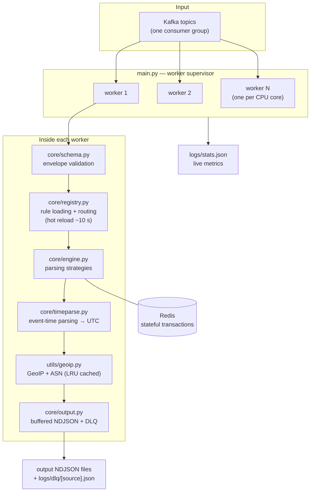
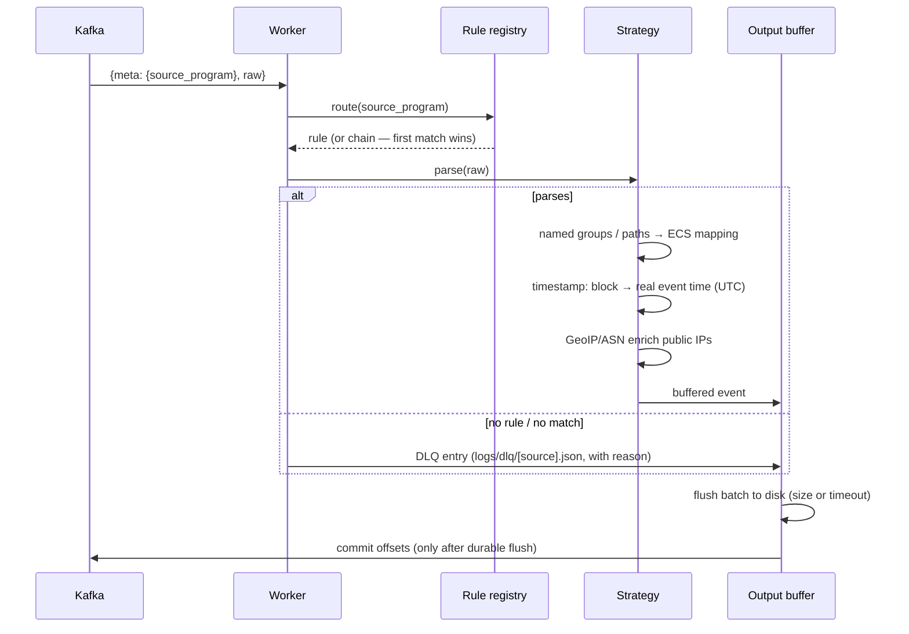

# Engine Architecture

How TLSOC Engine turns a raw Kafka message into an ECS-compliant event. For the
platform-wide picture, see
[tlsoc — Architecture](https://github.com/sankettaware16/tlsoc/blob/main/docs/architecture.md).

## Component overview

The Web UI (`webui/`) and the Kibana plugin (`elk-plugin/`) are consoles over the
*same* rules, config, and stats files — they reuse the real engine code for
testing and validation, so the UI and CLI can never disagree. Neither runs a
second engine.

## Message lifecycle

## Routing (polymorphic parsing)

`meta.source_program` is looked up in `program_mapping`; multiple source programs
can map to one reusable rule, and one source can map to a **chain** of rules
tried in order. A rule whose `pattern_name` equals the source program is the
fallback. This decouples log sources from parsing logic — onboarding a source is
a configuration change.

## Parsing strategies

| Strategy | Mechanism | Typical sources |
|---|---|---|
| `stateless` | one regex with named groups | Apache/Nginx access logs |
| `multi_match` | ordered pattern list, first match wins; `prematch` substring gate before each regex | Linux auth, SSH, sudo, cron |
| `stateful` | Redis-backed correlation by transaction ID (`id_regex`), closed by `end_signal` or TTL | Postfix mail flow, WAF transactions |
| `json_map` | dot-path mapping over parsed JSON, `*` wildcard for lists | ModSecurity, cloud audit logs |
| `xml_xpath` | ElementTree paths, one event per repeated element | OpenVAS/Nessus exports |

**The prematch gate**: every `multi_match`/`stateful` pattern can declare a plain
substring checked with a cheap `in` before the expensive regex runs. Almost all
patterns are skipped instantly, so a rule can grow to hundreds of patterns
without the linear regex-scan cost (a 500-pattern rule measures ~13× faster). It
is purely an optimization — rules produce identical output with or without it.
The deploy validator additionally runs a **ReDoS lint** on every regex to reject
catastrophic-backtracking shapes before they can stall a worker.

**Stateful timeouts**: transaction lifetime is per rule (`state_ttl_sec`,
default 300 s); transactions that never complete are emitted as
`event.incomplete: true` events instead of being dropped, so nothing is lost
silently.

## The two-timestamp model

`@timestamp` carries the event's **real** time, parsed from the log line itself
(per-rule `timestamp:` declaration — CLF, ISO 8601/RFC 5424, RFC 3164 syslog,
Unix epoch, and more) and normalized to UTC — so logs delayed by an outage or a
Kafka backlog still land on the correct day in Elasticsearch. Every event also
gets:

- `event.ingested` — when the engine parsed it (ingest lag =
  `event.ingested` − `@timestamp`)
- `event.timestamp_source` — `log` (parsed), `log_assumed_utc` (parsed, zone
  assumed), or `ingest_fallback` (unparseable → stamped at ingest, visibly
  tagged — never silent)

Reference for the `timestamp:` block: [writing-rules.md](writing-rules.md) §5.

## Enrichment

Public IPs are enriched fully **offline** (one-time MaxMind database download,
no per-lookup network calls), with per-process LRU caching:

- **GeoIP** (`GeoLite2-City.mmdb`) → `source.geo.*`: city, country,
  latitude/longitude
- **ASN** (`GeoLite2-ASN.mmdb`) → `source.as.number` +
  `source.as.organization.name`: which ISP, cloud, or hosting provider **owns**
  the IP — instantly separates residential users from VPS/botnet/scanner traffic

Both are switched by `geoip.enabled` in `config.yaml`. A missing library or
database means enrichment is quietly skipped, never a crash.

## Output and resilience

- Batched, per-worker NDJSON writers; Kafka offsets are committed **only after**
  a durable flush (at-least-once delivery — duplicates possible on a bad-disk
  day, silent loss is not).
- Per-source, size-capped dead-letter queues with rate-limited storm warnings.
- Graceful shutdown: clean flush and commit on `systemctl stop`/restart.
- Every event carries `ecs.version`, `event.ingested`, and
  `event.timestamp_source`.
- Optional `orjson` acceleration (installed automatically; stdlib fallback).

Operational detail — scaling, delivery guarantees, monitoring:
[deployment.md](deployment.md).

## ECS guarantee

Every field a rule produces must be a valid ECS field: `ecs_helper.py` is the
authoring aid ("spell-check for log fields"), and the deploy validator
(`test_config.py`) plus CI enforce it — a rule with bad field names cannot ship.
Genuine custom fields (where ECS has no equivalent) are allowed under a
product-named namespace. See [writing-rules.md](writing-rules.md).
